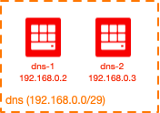
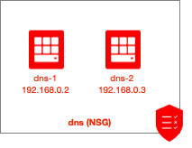
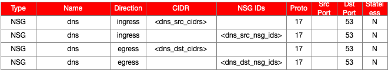

# Oracle Cloud Infrastructure (OCI) Hybrid DNS Module for Terraform

## Introduction

This module provides a way to provision a hybrid DNS solution in Oracle Cloud Infrastructure (OCI). 

## Solution

Hybrid DNS is a common component in many environments.  This module provides the ability to create the following resources:

| Resource | Created by Default? |
|---|---|
| Compute Instance(s) | Yes |
| Subnet | Yes |
| NSG | Yes |
| NSG Rules | Yes |

## Diagrams

### Topology
Here's a quick snapshot into the default topology created by this module:



### Security Policy
Here are the NSG(s) created by this module (by default):



Here's the default security policy that is created by this module:




## Getting Started

Several fully-functional examples have been provided in the `examples` directory.  Please reference the `README.md` in each example directory for any directions specific to the example.

For getting going quickly, at minimum, you need the following (for the most basic deployment):

```
module "dns" {
  source           = "../../"
  
  default_compartment_id = "${var.compartment_id}"
}
```

This will deploy a dns using the module defaults (review this document for a detailed description of these).

## Accessing the Solution

This is an architectural module, so there is not much to directly access (except the dns, if it's been requested to be created as a part of the solution).

You may continue to manage the environment using Terraform (ideal), OCI CLI, OCI console (UI), directly via the API, etc.

## Module Inputs

### Provider

The following IAM attributes are available in the the `terraform.tfvars` file:

```
### PRIMARY TENANCY DETAILS

# Get this from the bottom of the OCI screen (after logging in, after Tenancy ID: heading)
primary_tenancy_id="<tenancy OCID"
# Get this from OCI > Identity > Users (for your user account)
primary_user_id="<user OCID>"

# the fingerprint can be gathered from your user account (OCI > Identity > Users > click your username > API Keys fingerprint (select it, copy it and paste it below))
primary_fingerprint="<PEM key fingerprint>"
# this is the full path on your local system to the private key used for the API key pair
primary_private_key_path="<path to the private key that matches the fingerprint above>"

# region (us-phoenix-1, ca-toronto-1, etc)
primary_region="<your region>"

### DR TENANCY DETAILS

# Get this from the bottom of the OCI screen (after logging in, after Tenancy ID: heading)
dr_tenancy_id="<tenancy OCID"
# Get this from OCI > Identity > Users (for your user account)
dr_user_id="<user OCID>"

# the fingerprint can be gathered from your user account (OCI > Identity > Users > click your username > API Keys fingerprint (select it, copy it and paste it below))
dr_fingerprint="<PEM key fingerprint>"
# this is the full path on your local system to the private key used for the API key pair
dr_private_key_path="<path to the private key that matches the fingerprint above>"

# region (us-phoenix-1, ca-toronto-1, etc)
dr_region="<your region>"
```


| Attribute | Data Type | Required | Default Value | Valid Values | Description |
|---|---|---|---|---|---|
| default\_compartment\_id | string | yes | none | string of the compartment OCID | This is the default OCID that will be used when creating objects (unless overridden for any specific object).  This needs to be the OCID of a pre-existing compartment (it will not create the compartment. |
| vcn\_id | string | yes | none | string of the VCN OCID | The OCID of the VCN that is to be used must be provided here. |
| vcn\_cidr | string | yes | none | string of the VCN CIDR | The CIDR of the VCN that is to be used must be provided here. |
| default\_defined\_tags | map(string) | no | {} | Any map of tag names and values that is acceptable to the OCI API. | If any Defined Tags are set here, unless overwritten at the resource level, will be applied to all resources created by this module. |
| default\_freeform\_tags | map(string) | no | {} | Any map of tag names and values that is acceptable to the OCI API. | If any Freeform Tags are set here, unless overwritten at the resource level, will be applied to all resources created by this module. |
| default\_ssh\_auth\_keys | list(string) | no | [] | Any list of public (authorized) SSH keys. | The different authorized keys that are used (unless otherwise indicated on compute instances). |
| default\_img\_id | string | no | null | OCID of compute instance image. | If this is provided, it can be used as the default image OCID for resources created (unless otherwise specified at the resource level). |
| default\_img\_name | string | no | null | Name of compute instance image. | If this is provided, it can be used as the default image to be used for resources created (unless otherwise specified at the resource level).  The name can be obtained from https://docs.cloud.oracle.com/iaas/images/.  By providing a name (rather than an OCID), the module looks up the OCID (by the name) automatically. |
| create\_subnet | bool | no | true | true or false | Whether or not a subnet should be created for the dns. |
| existing\_subnet\_id | string | no | none | OCID of an existing subnet to use | The OCID of the subnet where the dns should be placed. |
| subnet\_options | see below | no | see below | see below | Parameters for customizing the subnet that is created (if create\_subnet is true). |
| create\_nsg | bool | no | true | true or false | Whether or not a new NSG should be created for the dns. |
| existing\_nsg\_id | string | no | none | OCID of an existing NSG to use | The OCID of the NSG where new rules (specific for the dns requirements) should be placed. |
| nsg\_options | see below | no | see below | see below | Parameters for customizing the NSG that is created (if create\_nsg is true). |
| nsg\_ids\_to\_associate | list(string) | no | none | OCID of existing NSG(s) | If there are additional NSGs which should be associated to the compute instance(s), provide them here. |
| dns\_src\_cidrs | list(string) | no | none | List of strings of CIDR(s) | Specify the CIDRs that should be allowed to query DNS (udp/53) into the compute instance(s).  This effectively manages the ingress rules created that allow DNS queries into the DNS NSG. |
| dns\_dst\_cidrs | list(string) | no | none | List of strings of CIDR(s) | Specify the CIDRs that the DNS forwarders should be allowed to query (via DNS, udp/53).  This effectively manages the egress rules created that allow DNS queries from the DNS NSG to other CIDRs. |
| dns\_src\_nsg\_ids | list(string) | no | none | List of strings of NSG OCID(s) | Specify the NSG OCIDs that should be allowed to query DNS to the DNS forwarders compute instance(s).  This effectively manages the ingress rules created that allow DNS into the DNS NSG. |
| dns\_dst\_nsg\_ids | list(string) | no | none | List of strings of NSG OCID(s) | Specify the NSG OCIDs that the DNS forwarders should be allowed access via DNS (udp/53).  This effectively manages the egress rules created that allow DNS queries from the DNS NSG to other NSGs. |
| create\_compute | bool | no | true | true or false | Whether or not a new compute instance for the dns. |
| num\_dns\_forwarders | number | no | 2 | 1, 2 or 3 | How many DNS forwarders should be created. |
| compute\_options | see below | no | see below | see below | Parameters for customizing the compute instance(s) that is created (if create\_compute is true). |
| dns\_forwarder\_1 | see below | no | see below | see below | Parameters for customizing DNS forwarder #1 that is created (if create\_compute is true). |
| dns\_forwarder\_2 | see below | no | see below | see below | Parameters for customizing DNS forwarder #2 that is created (if create\_compute is true). |
| dns\_forwarder\_3 | see below | no | see below | see below | Parameters for customizing DNS forwarder #3 that is created (if create\_compute is true). |
| dns\_namespace\_mappings | see below | no | see below | see below | Setting the mapping between DNS namespaces and the DNS forwarders that should be queried for each namespace. |
| reverse\_dns\_mappings | see below | no | see below | see below | Reverse DNS mapping entries. |

## Subnet Options

The `subnet_options` attribute is an optional map attribute.  Note that if this attribute is used, all keys/values must be specified (Terraform does not allow for default or optional map keys/values).  It has the following defined keys (and default values):

| Key | Data Type | Default Value | Valid Values | Description |
|---|---|---|---|---|
| name | string | "dns" | Any name acceptable to the OCI API. | Used to define a specific name for the subnet. |
| compartment\_id | string | null | Compartment OCID | Pre-existing compartment OCID (if default compartment is not to be used).  If this value is null, the default compartment OCID will be used. |
| defined\_tags | map(string) | {} | Any map of tag names and values that is acceptable to the OCI API. | If any Defined Tags should be set on this resource, do so with this attribute.  If not specified, the default\_defined\_tags value will be used. |
| freeform\_tags | map(string) | {} | Any map of tag names and values that is acceptable to the OCI API. | If any Freeform Tags should be set on this resource, do so with this attribute.  If not specified, the default\_freeform\_tags value will be used. |
| cidr | string | "192.168.0.8/29" | IPv4 CIDR | Specify the IPv4 CIDR to be used for the Subnet.  If dynamic_cidr is true, the CIDR specified here will be used in the subnet calculation.  If dynamic_cidr is false, the CIDR specified here will be the one used by the subnet. |
| cidr\_len | number | none | Any number between 16 and 30 | This is the desired bit length (number of bits in the subnet mask) for the new, dynamically generated subnet CIDR.  Only applicable if dynamic_cidr is true. |
| cidr\_num | number | none | This is the zero-indexed network number that should be used for the subnet.  For example, let's say that cidr is 192.168.0.0/16 and cidr\_len is 24.  For cidr\_num of 1, a dynamically generated CIDR of 192.168.1.0/24 would be given.  In the same scenario, with a cidr\_num of 0, 192.168.0.0/24 would result and cidr\_num of 240 would yield 192.168.240.0/24. |
| enable\_dns | bool | true | Whether or not DNS should be enabled for the subnet. |
| dns\_label | string | "dns" | Valid DNS name. | Specify the DNS label to be used for the subnet.  If this value is null, a dynamically generated value of *subnet<index_num>* will be used.  For example, the third subnet definition, if DNS is enabled, but no dns_label is provided (a null value is given), a value of *subnet2* will be generated (remembering that index numbers are zero-indexed). |
| private | bool | false | true/false | If set to true, the subnet will be a private subnet.  If set to false, a public subnet will be created.  Many dnss are public, which is why the subnet `private` attribute defaults to true for the dns module. |
| ad | number | null | null, 0, 1 or 2 (dependent upon the number of available Availability Domains (ADs) in the specific region being used) | If a regional subnet is desired, leave this value as null, otherwise specify the AD number (zero-index, meaning AD1 = 0, AD2 = 1, AD3 = 2) to create an AD-specific subnet. |
| dhcp\_options\_id | string | null | null or OCID | Specify the OCID of the DHCP Options to use for the subnet. |
| route\_table\_id | string | null | null or OCID | Specify the OCID of the Route Table to use for the subnet. |
| security\_list\_ids | list of strings | null | null or list of OCID(s) | Specify the OCID(s) of the Security List(s) to use for the subnet, in list form. |

These options are largely a pass-through for the Subnet core module.

Example:

```
module "dns" {
  ... /snip - shortened for brevity...

  default_compartment_id  = var.default_compartment_id
  
  subnet_options      = {
    name              = "test"
    compartment_id    = null
    defined_tags      = null
    freeform_tags     = null
    dynamic_cidr      = false
    cidr              = "192.168.0.0/30"
    cidr_len          = null
    cidr_num          = null
    enable_dns        = true
    dns_label         = "test1"
    private           = true
    ad                = null
    dhcp_options_id   = null
    route_table_id    = null
    security_list_ids = null
  }
}
```

The above example will create a private subnet with a name (display name) of *test*, DNS label of *test1*, a CIDR of *192.168..0.0/30*, using the default compartment OCID.

##### nsg_options

The `nsg_options` variable is an optional map attribute.  Note that if this attribute is used, all keys/values must be specified (Terraform does not allow for default or optional map keys/values).  It has the following defined keys (and default values):

| Key | Data Type | Default Value | Valid Values | Description |
|---|---|---|---|---|
| name | string | "dns" | A name recognized as valid by the OCI API. | This is the name of the NSG that is to be created. |
| compartment\_id | string | null | Compartment OCID | Pre-existing compartment OCID (if default compartment is not to be used).  If this value is null, the default compartment OCID will be used. |
| defined\_tags | map(string) | {} | Any map of tag names and values that is acceptable to the OCI API. | If any Defined Tags should be set on this resource, do so with this attribute.  If not specified, the default\_defined\_tags value will be used. |
| freeform\_tags | map(string) | {} | Any map of tag names and values that is acceptable to the OCI API. | If any Freeform Tags should be set on this resource, do so with this attribute.  If not specified, the default\_freeform\_tags value will be used. |

Example:

```
module "dns" {
  ... /snip - shortened for brevity...

  default_compartment_id  = var.default_compartment_id
  
  nsg_options         = {
    name              = "awesome_dns"
    compartment_id    = null
    defined_tags      = null
    freeform_tags     = null
  }
}
```

The above example will create a NSG with a name of `awesome_dns`, using the default compartment ID and tags (defined and freeform).

##### compute_options

The `compute_options` attribute is an optional map attribute that is used to configure attributes of all DNS forwarder compute instances.  Instance-specific attributes are set elsewhere.  Note that if this attribute is used, all keys/values must be specified (Terraform does not allow for default or optional map keys/values).  It has the following defined keys (and default values):

| Key | Data Type | Default Value | Valid Values | Description |
|---|---|---|---|---|
| compartment\_id | string | null | Compartment OCID | Pre-existing compartment OCID (if default compartment is not to be used).  If this value is null, the default compartment OCID will be used. |
| defined\_tags | map(string) | {} | Any map of tag names and values that is acceptable to the OCI API. | If any Defined Tags should be set on this resource, do so with this attribute.  If not specified, the default\_defined\_tags value will be used. |
| freeform\_tags | map(string) | {} | Any map of tag names and values that is acceptable to the OCI API. | If any Freeform Tags should be set on this resource, do so with this attribute.  If not specified, the default\_freeform\_tags value will be used. |
| shape | string | "VM.Standard2.1" | String of valid OCI shape. | Provide the desired shape to be used for the new compute instance(s). |
| vnic\_defined\_tags | map(string) | {} | Any map of tag names and values that is acceptable to the OCI API. | If any Defined Tags should be set on the vNIC, do so with this attribute.  If not specified, the default\_defined\_tags value will be used. |
| vnic\_freeform\_tags | map(string) | {} | Any map of tag names and values that is acceptable to the OCI API. | If any Freeform Tags should be set on the vNIC, do so with this attribute.  If not specified, the default\_freeform\_tags value will be used. |
| public\_ip | bool | false | true or false | Whether or not a public IP address should be allocated to the compute instance. |
| ssh\_auth\_keys | list(string) | default\_ssh\_auth\_keys | A list of strings of public (authorized) SSH keys. | If you've provided a value for default\_ssh\_auth\_keys and do not wish to override this, there's no need to set this to anything besides null.  If you do want to specify different/unique SSH authorized keys, specify them here. |
| user\_data | string | null | Any base64-encoded string. | If you wish to specify the cloud-init meta-data, provide this here (make sure to encode it as base64). |
| boot\_vol\_img\_name | string | null | Any valid OCI image name. | You may provide a name of a specific compute image you'd like to use here.  If not set, it'll default to using whatever default\_img\_name is set to. |
| boot\_vol\_img\_id | string | null | Valid OCID of a compute image. | You can specify the OCID of a compute image by setting this value.  If an OCID is provided, the image name will not be used (OCID has a higher precedence than the image name). |
| boot\_vol_size | number | 60 | The size (in GB) of the boot volume. | Specify the size of the boot volume (in GB). |

Example:

```
module "dns" {
  ... /snip - shortened for brevity...

  compute_options     = {
    compartment_id    = null
    shape             = "VM.Standard2.8"
    public_ip         = true
    defined_tags      = null
    freeform_tags     = null
    vnic_defined_tags = null
    vnic_freeform_tags = null
    ssh_auth_keys     = null
    user_data         = null
    boot_vol_img_name = null
    boot_vol_img_id   = null
    boot_vol_size     = 500
  }
}
```

The above example will configure the module to use the default compartment OCID, set all DNS forwarders  a compute instance in AD2, with a VM Standard 2.8 shape, name of *my_dns* and DNS label of *mydns*, with a boot volume size of 500GB, using the default compartment OCID.

#### dns_forwarder_1

The `dns_forwarder_1` attribute is an optional map attribute that is used to configure attributes of the first DNS forwarder compute instance.  These are the instance-specific details that are only relevant to a this compute instance.  Note that if this attribute is used, all keys/values must be specified (Terraform does not allow for default or optional map keys/values).  It has the following defined keys (and default values):

| Key | Data Type | Default Value | Valid Values | Description |
|---|---|---|---|---|
| ad | number | 0 | The zero-indexed number of the desired AD. | Provide a number to indicate the AD you'd like the compute instance deployed to.  The number should be zero-indexed, meaning AD1 = 0, AD2 = 1, AD3 = 2, etc. |
| fd | string | none | A string designating a valid FD. | The Fault Domain (FD) that should be used.  If not specified, it will be left up to OCI to designate the FD. |
| private\_ip | string | null | null or any valid IP address string. | If you desire to specify a specific static private IP address, provide the value here.  If you do not provide a value, the next available private IP address will be used. |
| name | string | "dns-1" | Any valid name string. | The name of the compute instance to create. |
| hostname_label | string | "dns-1" | Any valid hostname string. | The DNS name (label) to use for the compute instance. |
| kms\_key\_id | string | null | String of KMS OCID. | If KMS should be used, provide the key OCID. |

Example:

```
module "dns" {
  ... /snip - shortened for brevity...

  dns_forwarder_1     = {
    ad                = 0
    fd                = null
    private_ip        = "10.1.2.3"
    name              = "dns-123
    hostname_label    = "dns"
    kms_key_id        = null
  }
}
```

The above example will configure DNS forwarder #1 to have a private IP of *10.1.2.3*, residing in AD1 and have a display name of *dns-123* and a DNS label of *dns*.

#### dns_forwarder_2

The `dns_forwarder_2` attribute is an optional map attribute that is used to configure attributes of the second DNS forwarder compute instance.  These are the instance-specific details that are only relevant to a this compute instance.  Note that if this attribute is used, all keys/values must be specified (Terraform does not allow for default or optional map keys/values).  It has the following defined keys (and default values):

| Key | Data Type | Default Value | Valid Values | Description |
|---|---|---|---|---|
| ad | number | 0 | The zero-indexed number of the desired AD. | Provide a number to indicate the AD you'd like the compute instance deployed to.  The number should be zero-indexed, meaning AD1 = 0, AD2 = 1, AD3 = 2, etc. |
| fd | string | none | A string designating a valid FD. | The Fault Domain (FD) that should be used.  If not specified, it will be left up to OCI to designate the FD. |
| private\_ip | string | null | null or any valid IP address string. | If you desire to specify a specific static private IP address, provide the value here.  If you do not provide a value, the next available private IP address will be used. |
| name | string | "dns-1" | Any valid name string. | The name of the compute instance to create. |
| hostname_label | string | "dns-1" | Any valid hostname string. | The DNS name (label) to use for the compute instance. |
| kms\_key\_id | string | null | String of KMS OCID. | If KMS should be used, provide the key OCID. |

See dns_forwarder_1 for a sample example.

#### dns_forwarder_3

The `dns_forwarder_3` attribute is an optional map attribute that is used to configure attributes of the third DNS forwarder compute instance.  These are the instance-specific details that are only relevant to a this compute instance.  Note that if this attribute is used, all keys/values must be specified (Terraform does not allow for default or optional map keys/values).  It has the following defined keys (and default values):

| Key | Data Type | Default Value | Valid Values | Description |
|---|---|---|---|---|
| ad | number | 0 | The zero-indexed number of the desired AD. | Provide a number to indicate the AD you'd like the compute instance deployed to.  The number should be zero-indexed, meaning AD1 = 0, AD2 = 1, AD3 = 2, etc. |
| fd | string | none | A string designating a valid FD. | The Fault Domain (FD) that should be used.  If not specified, it will be left up to OCI to designate the FD. |
| private\_ip | string | null | null or any valid IP address string. | If you desire to specify a specific static private IP address, provide the value here.  If you do not provide a value, the next available private IP address will be used. |
| name | string | "dns-1" | Any valid name string. | The name of the compute instance to create. |
| hostname_label | string | "dns-1" | Any valid hostname string. | The DNS name (label) to use for the compute instance. |
| kms\_key\_id | string | null | String of KMS OCID. | If KMS should be used, provide the key OCID. |

See dns_forwarder_1 for a sample example.

#### dns_namespace_mappings

The `dns_namespace_mappings` attribute is an optional map attribute that is used to configure the mapping of DNS namespaces to specific upstream DNS forwarders.  This attribute is a list of maps.  Note that if a single map attribute is used, all keys/values must be specified for that single map attribute (Terraform does not allow for default or optional map keys/values).  It has the following defined keys (and default values):

| Key | Data Type | Default Value | Valid Values | Description |
|---|---|---|---|---|
| namespace | string | none | Any valid DNS namespace string. | Provide the DNS namespace (domain name) that is to be mapped to a specific upstream server IP. |
| server | string | none | A string designating the upstream server's IP address. | Specify the upstream DNS forwarder that should be queried for the specific DNS namespace. |

Example:

```
module "dns" {
  ... /snip - shortened for brevity...

  dns_namespace_mappings = [
    {
      namespace       = "mydomain.local."
      server          = "172.16.1.2"
    },
    {
      namespace       = "test.local."
      server          = "192.168.255.12"
    }
  ]
}
```

The above example provides two DNS namespace mappings, configuring the DNS forwarders send requests for *mydomain.local.* to the forwarder at *172.16.1.2* and the *test.local.* DNS namespace to forwarder at *192.168.255.12*.

#### reverse_dns_mappings

The `reverse_dns_mappings` attribute is an optional map attribute that is used to configure the mapping of reverse DNS entries, where a CIDR (what would be used for the reverse DNS lookup) and an upstream server is specified.  This attribute is a list of maps.  Note that if a single map attribute is used, all keys/values must be specified for that single map attribute (Terraform does not allow for default or optional map keys/values).  It has the following defined keys (and default values):

| Key | Data Type | Default Value | Valid Values | Description |
|---|---|---|---|---|
| cidr | string | none | Any valid CIDR string. | Provide the IP space that will be used for the reverse DNS lookup. |
| server | string | none | A string designating the upstream server's IP address. | Specify the upstream DNS forwarder that should be queried for the specific reverse DNS CIDR. |

Example:

```
module "dns" {
  ... /snip - shortened for brevity...

  reverse_dns_mappings = [
    {
      cidr.           = "10.0.0.0/8"
      server          = "172.16.1.2"
    },
    {
      namespace       = "172.16.0.0/12"
      server          = "192.168.255.12"
    }
  ]
}
```

The above example provides two reverse DNS mappings, configuring the DNS forwarders send reverse DNS queries for addresses in the *10.0.0.0/8* address space to the forwarder at *172.16.1.2* and the *172.16.0.0/12* address space to forwarder at *192.168.255.12*.

### Outputs

This module returns the following resources

* `subnet`: The subnet that has been created by the module. If existing subnet is provided, no output is returned
* `nsg`: NSG that has been created by the module. If existing NSG is provided, no output is returned
* `nsg_rules`: Contains rules created by the module (whether added to a new or existing NSG)
* `instances`: Contains compute instance(s) that have been created by the module. |
* `cloud_init_data`: Contains cloud-init meta-data used to provision the DNS forwarders.  Note that if customized user-data is provided (in the compute_options attribute), it will not be reflected here (this only presents the default value as computed). 


Note that you may still reference the outputs (even if they're not returned) without causing an error in Terraform.


## Notes/Issues

* Note that if you provide any single element in the different resource maps (`subnet_options`, `nsg_options`, etc), you must provide all of them.  Maps do not have a notion of an optional (or default value) for keys within the map, requiring that all keys/values be passed (if one key is passed, all keys must be passed).

## Release Notes

See [./docs/release_notes.md](release notes) for release notes information.

## URLs

* For Oracle Cloud Infrastructure File Storage Service documentation, see https://docs.cloud.oracle.com/iaas/Content/Network/Concepts/networksecuritygroups.htm?Highlight=NSG

## Versions

This module has been developed and tested by running terraform on macOS Mojave Version 10.14.5

```
user-mac$ terraform --version
Terraform v0.12.3
+ provider.oci v3.31.0
```


## Contributing

This project is open source. Oracle appreciates any contributions that are made by the open source community.

## License

Copyright (c) 2020 Oracle and/or its affiliates.
Licensed under the Universal Permissive License v 1.0 as shown at https://oss.oracle.com/licenses/upl.

See [LICENSE](LICENSE) for more details.
