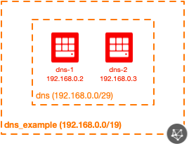

# OCI Hybrid DNS Module Example (Simple)

## Introduction

| Complexity |
|---|
| Simple |

This example shows how to utilize the hybrid DNS module in a very simplistic way, generating a VCN along with some accompanying resources.  Here are all of the resources created in this example:

* 1x VCN
* 1x Hybrid DNS module
	* 1x Subnet
	* 2x Compute instances
	* 1x NSG
	* NSG rules

This allocates two private DNS forwarders using the hybrid DNS forwarders.

## Topology Diagram
This example is intended to the following OCI topology:



## Using this example
Prepare one variable file named `terraform.tfvars` with the required information (or feel free to copy the contents from `terraform.tfvars.template`).  The contents of `terraform.tfvars` should look something like the following:

```
tenancy_ocid = "ocid1.tenancy.oc1..xxxxxxxxxxxxxxxxxxxxxxxxxxxxxxxxxxxxxxxxxxxxxxxxxxxxxxxxxxxx"
user_ocid = "ocid1.user.oc1..xxxxxxxxxxxxxxxxxxxxxxxxxxxxxxxxxxxxxxxxxxxxxxxxxxxxxxxxxxxx"
fingerprint= "xx:xx:xx:xx:xx:xx:xx:xx:xx:xx:xx:xx:xx:xx:xx:xx"
private_key_path = "~/.oci/oci_api_key.pem"
region = "us-phoenix-1"
default_compartment_ocid = "ocid1.compartment.oc1..xxxxxxxxxxxxxxxxxxxxxxxxxxxxxxxxxxxxxxxxxxxxxxxxxxxxxxxxxxxx"
default_ssh_auth_keys=[ "<path to your public SSH key(s)>" ]
# see https://docs.cloud.oracle.com/iaas/images/ for a listing of OCI-provided image OCIDs
default_img_id="<image OCID>"
default_img_name="<image name>"
```

Then apply the example using the following commands:

```
$ terraform init
$ terraform plan
$ terraform apply
```
